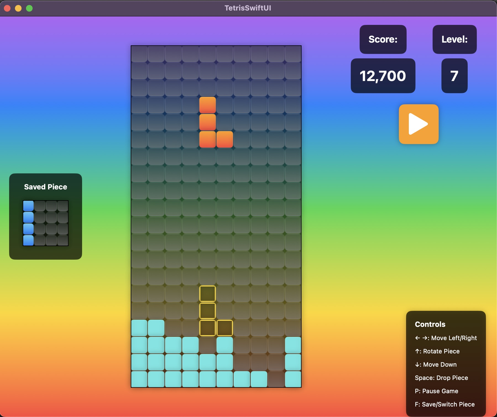

## TetrisCraze

An implementation of tetris for the Mac Desktop using SwiftUI. This was mainly started as a way to experiment with Swift for MacOS.

The game is currently fully featured and will work if cloned and run in XCode. I haven't yet made a distributable, although I am planning on doing that as well. Below is a screenshot of a roughly accurate state of the game right now. It isn't updated very frequently, so it may be out of date while I'm still updating this game.

